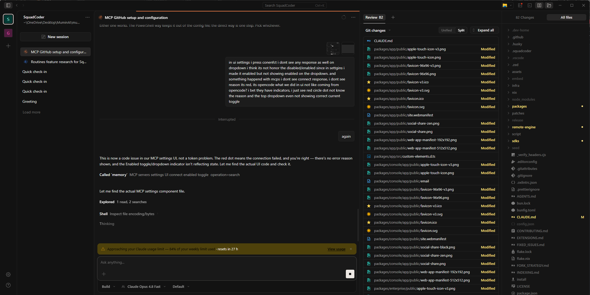

<div align="center">

<pre>
  ____                       _  ____          _
 / ___|  __ _ _   _  __ _  __| |/ ___|___   __| | ___ _ __
 \___ \ / _` | | | |/ _` |/ _` | |   / _ \ / _` |/ _ \ '__|
  ___) | (_| | |_| | (_| | (_| | |__| (_) | (_| |  __/ |
 |____/ \__, |\__,_|\__,_|\__,_|\____\___/ \__,_|\___|_|
           |_|
</pre>

# SquadCoder

### Your entire engineering team, one install away.

Other AI coding tools give you **one assistant**. SquadCoder gives you **a whole company** — an Architect, Developers, QA, Security, UI/UX, and a CTO quality gate — that plan, build, review, and ship features **in parallel**, out of the box, with **zero configuration**.

[](LICENSE)
[](#install)
[](https://github.com/squadcodercom/squadcoder/releases)
[](#contributing)



[Download](#install) &nbsp;&bull;&nbsp; [Quick Start](#quick-start) &nbsp;&bull;&nbsp; [Features](#what-you-get) &nbsp;&bull;&nbsp; [Team Mode](#how-team-mode-works) &nbsp;&bull;&nbsp; [Showcase](#built-with-squadcoder) &nbsp;&bull;&nbsp; [Docs](docs/)

</div>

---

## Why SquadCoder?

Most AI coding tools are **one agent talking to one model**. When the task gets complex, you babysit it — prompt-by-prompt, file-by-file, hoping it doesn't forget what it did three messages ago.

**SquadCoder runs like a real engineering org:**

- You describe what you want — a feature, a fix, a refactor, a full project.
- An **orchestrator** breaks it into tasks and spins up the right specialists — _in parallel_.
- Each specialist does its job (architecture, implementation, testing, security review, UI/UX verification).
- A **CTO quality gate** loops fixes until every check is green.
- You get **one coherent, verified result** — not a pile of raw agent output.

All of this happens **on first install, with zero configuration.** Open a folder, type a request, switch to Team Mode. That's it.

---

## What you get

| | Feature | Why it matters |
|---|---|---|
| **Squad** | **Team Mode** — parallel specialist agents with a quality gate | One request kicks off an entire dev cycle: plan, code, test, review, ship. |
| **Brain** | **Persistent memory** — never forgets | Project rules, architecture decisions, and past fixes survive across sessions. Your assistant gets smarter about _your_ codebase over time. |
| **Search** | **Semantic codebase index** — find code by meaning | Fully offline, bundled model. No cloud, no API cost. Ask "where do we handle auth?" and get the right files. |
| **Skills** | **820+ bundled skills** — ready on first launch | Design systems, code review, document generation, ad platforms (Google/Meta/TikTok), and more. Skills auto-fire when relevant — no manual activation. |
| **Tools** | **MCP-native** — built-in integrations | GitHub, Playwright (browser testing), web search, docs lookup, and any MCP server you add. |
| **Remote** | **Remote SSH** — work on any machine | VS Code-style remote: connect to a server, index its code, run agents there. |
| **Clock** | **Routines & scheduling** | Save multi-step tasks and run them on demand or on a schedule. |
| **Lock** | **Local-first & private** | Your code and context stay on your machine. No telemetry, no cloud dependency. |
| **Heart** | **Open source (MIT)** | Free to use, modify, and distribute. Built on [opencode](https://github.com/sst/opencode). |
| **Globe** | **Full Hebrew GUI + 25 languages** | 100% translated (1700+ keys), full RTL layout, bundled Hebrew font (Rubik). First-class Hebrew & Arabic, plus 25+ more languages. |

---

## Install

### Desktop app (recommended)

Download from [**Releases**](https://github.com/squadcodercom/squadcoder/releases/latest) and run:

| Platform | File | Size |
|----------|------|------|
| **Windows x64** | [`SquadCoder-desktop-win-x64-installer.exe`](https://github.com/squadcodercom/squadcoder/releases/latest) | ~214 MB |
| **Windows x64 (portable)** | [`SquadCoder-desktop-win-x64-portable.zip`](https://github.com/squadcodercom/squadcoder/releases/latest) | ~165 MB |
| macOS / Linux | Coming soon | — |

### CLI

Download the standalone CLI from [**Releases**](https://github.com/squadcodercom/squadcoder/releases/latest):

| Platform | File | Size |
|----------|------|------|
| **Windows x64** | [`SquadCoder-cli-windows-x64.zip`](https://github.com/squadcodercom/squadcoder/releases/latest) | ~48 MB |

Unzip and add to your `PATH`. Run `squadcoder` from any project directory.

### From source

```bash
git clone https://github.com/squadcodercom/squadcoder.git
cd squadcoder
bun install
bun run dev        # desktop app + engine (hot reload)
# or
bun run cli        # CLI only
```

> Requires [Bun](https://bun.sh) >= 1.3.11

---

## Quick start

1. **Launch** SquadCoder (desktop app or `squadcoder` CLI).
2. **Add a model** — bring your own API key (Anthropic, OpenRouter, or any OpenAI-compatible provider).
3. **Open a project** folder and start chatting.
4. **Switch to Team Mode** for anything multi-step — SquadCoder will plan it, split the work across specialist agents, build it, test it, and review it before handing it back.

> **Tip:** You don't need to configure agents, skills, or MCPs. Everything ships pre-configured and works out of the box. Just add your API key and go.

---

## How Team Mode works

```
You: "Add user authentication with OAuth"
                    |
            [ Orchestrator ]
           /    |     |     \
     Architect  Dev1  Dev2  Security
          \     |     |     /
           [ CTO Quality Gate ]
            loops until green
                    |
            [ Verified Result ]
```

A single **orchestrator** reads your request, classifies it, and spawns only the specialists the task needs — running independent units **in parallel**. Every fix loops through a **CTO-style quality gate** (security + QA + end-to-end verification) until it passes. You get one coherent, tested result.

The team ships pre-configured with sensible roles and model assignments. You can customize roles, add your own agents, or change which model each agent uses — but you don't have to.

---

## Configuration

SquadCoder works with zero config, but everything is customizable via `squadcoder.json`:

- **Model providers** — Anthropic (Claude), OpenRouter, OpenAI, Gemini, or any OpenAI-compatible endpoint.
- **MCP servers** — add any MCP server (local or remote).
- **Skills** — drop a `SKILL.md` into `.squadcoder/skills/` to teach your agents new capabilities.
- **Agent roles** — customize the Team Mode roster, or create your own specialist agents.
- **Secrets** — use `{env:VAR}` or `${VAR}` placeholders. Never hard-code tokens.

---

## Contributing

Contributions are welcome! Open an issue to discuss a change, or send a pull request. Please run `bun typecheck` before submitting.

For collaboration, partnerships, or anything else — reach out at **[raviv@mailbux.com](mailto:raviv@mailbux.com)**.

---

## Built with SquadCoder

Real, shipping products built by the same team behind SquadCoder — proof the squad ships:

| Product | What it is |
|---------|------------|
| **[mailbux.com](https://mailbux.com)** | Email infrastructure & inbox tooling. |
| **[openadmanager.com](https://openadmanager.com)** | Open ad campaign management across Google, Meta & TikTok. |
| **[formtix.com](https://formtix.com)** | Forms, registrations & ticketing. |

Want to build something together? **[raviv@mailbux.com](mailto:raviv@mailbux.com)**

## License

[MIT](LICENSE) — free to use, modify, and distribute.

<div align="center">
<sub>Created with ❤️ by <a href="mailto:raviv@mailbux.com">Raviv</a> and the SquadCoder community. Fork of <a href="https://github.com/sst/opencode">opencode</a> via <a href="https://github.com/XiaomiMiMo/MiMo-Code">MiMoCode</a>.</sub>
</div>
